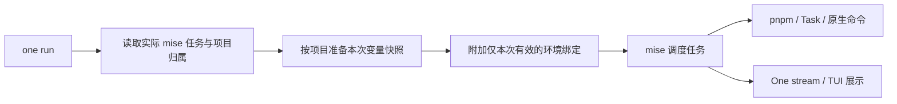

# One CLI 原生 mise 任务、环境注入与终端输出规划

日期：2026-09-29

状态：实现已落地，以下先记录实现与验证边界，再保留原始规划供审阅。

## 本轮实现记录

- 已删除 `__task`、`__task-input`、`__exec`，生成任务直接执行 pnpm / Task。`one exec` 在内存中取得 mise 环境后直接启动目标命令。
- `one run`、任务列表与 Dashboard 读取实际 mise 目录；dry-run 使用只读静态目录，支持根与项目配置、静态 includes、file tasks、别名和本地覆盖。不自动生成 dev，不从 manifest 恢复命令。
- manifest 停用 dev.command；显式初始化删除旧 dev 对象并将 URL 移入 service.url。Dashboard 删除命令编辑框，按真正可选择的 dev 任务决定是否可启动。
- 环境变量通过原 Infisical Loader 按实际目录获取，每个项目、每次调用独立快照；内置插件由内容哈希定位并原子安装。临时 `.one-run-*/bindings.toml` 按原生配置作用域生成，不包含值；已配置 Git 忽略规则，退出清理。无需手写环境插件声明。
- 注入远端变量的任务及下游可执行任务关闭产物缓存和文件新鲜度跳过，普通原生任务保持声明。已验证缓存开启且已有产物时，轮换值、删变量和下游任务仍重新运行。
- 已删除子进程输出脱敏；One 不打印注入值。stream / TUI / raw 共用 mise 调度。taskUI 偏好可选 stream 或 tui，--ui 覆盖。
- TUI 支持任务选择、全部日志、搜索、暂停/跟随、缩放和中文显示；后续 TUI 改进保留全部会话历史（私有临时文件、内存索引与页面缓存），保留 mise 前缀及 Task 回显；长行自动换行、缩放锚定阅读位置，支持鼠标、逐行、翻页和首尾滚动。mise 执行结束后自动退出 TUI 并保留原退出码；运行期间可浏览全部历史。侧栏按计划展示依赖树，支持展开/折叠，共享节点用引用连接同一份日志；窄屏通过 Tab 切换树和日志。展示整体运行时间，不推断单任务成功、就绪或缓存命中。

仓库验收：`mise run check` 已通过，包含 Go 全量测试、Dashboard 102 项测试、文档/帮助检查与格式检查；tasks、taskui、toolenv、exec 的 `go test -race` 通过。

实际验证使用模拟变量，不读取真实账号密钥：Linux 上 mise 2026.9.7 和 2026.9.15 的项目并行、独立并发调用、特殊字符、空值、变量删除、孙进程继承、原生项目同名任务、别名、本地覆盖及缓存失效均通过。真实 PTY 验证 TUI、缩放、取消、终端恢复与失败退出码；直接 exec 的 SIGINT/SIGTERM 和孙进程清理通过。Windows/macOS 完成交叉编译，本地未进行其原生执行，保留现有 CI 的原生测试职责。

仍需明确的支持边界：profile 若重新定义完整命令并覆盖临时绑定，执行前报错；应将命令放在基础/local 配置，让 profile 调整环境。自定义配置文件发现若改变原有配置层也会拒绝执行。静态 dry-run 不执行动态模板、复杂根 glob 或缓存输入。TUI 没有可靠的逐任务生命周期数据，不提供逐任务重启。

以下为实施前的需求与设计记录；与本节不同的方案、候选项及“待实现”描述以本节和当前使用文档为准。

本文承接本轮讨论，替代旧任务统一规划中关于独立 dev 入口、manifest 开发命令、任务执行包装、日志脱敏和终端展示的相冲突设计。保留现有 mise 调度、pnpm / Task 分工及其他无关功能。manifest 格式转换暂停，继续使用 `one.manifest.json`。

## 1. 最终目标与范围

| 需求 | 目标行为 |
| --- | --- |
| 命令入口 | 以现有 `one run <task>` 为统一入口；不恢复独立内置 `one dev` |
| 任务来源 | 执行、列表和 Dashboard 均以实际生效的 mise 任务为准 |
| dev 清理 | 移除 `projects[].dev.command` 的执行、推断和写入逻辑 |
| 原生任务 | `run` 直接调用 `pnpm run …`、`task …` 或用户命令 |
| 配置简洁 | 用户无需写 `one __task`、`one __task-input` 或逐任务环境插件绑定 |
| Infisical | One 在运行时按项目自动获取和注入变量，保持并行隔离 |
| 日志 | 删除 One 对任务子进程输出的值扫描和自动替换；One 自身不展示敏感变量值 |
| 终端 | 支持 stream / TUI 配置与单次命令覆盖，参考 Turbo 的任务列表和日志浏览交互 |
| Dashboard | 任务能力来自 mise；移除独立开发命令编辑，复用统一执行流程 |
| 语言与平台 | 用户可见变化同步提供 zh-CN / en-US；覆盖 Linux / macOS / Windows |

不引入 Turbo 执行器，不另建任务调度器，不改变 Infisical 的登录、项目绑定和环境管理体系。`one exec` 继续作为显式任意命令入口，不作为生成任务的默认包装。

## 2. 命令与任务存在性

正式文档与示例统一使用：

```sh
one run
one run dev
one run dev -p dashboard
one run build -p cli
one run dev --ui tui
one run dev --ui stream
one run build --dry-run
```

- `one run` 无任务名时列出任务。
- `one run dev` 仅在根作用域实际存在 dev 任务时执行；只有项目 dev 不能代替缺失的根 dev。
- `one run dev -p api` 必须能解析到 api 项目的对应任务。多个显式项目中任一个缺失，执行前报错。
- dev 与 build、test、自定义任务使用相同的解析与执行逻辑。
- 已有 `one <task>` 通用简写保留，不注册 dev 专用 Cobra 命令，不赋予 dev 专属任务来源。
- 保留现有 `--env`、`--concurrency`、`--cache`、`--force`、项目选择和参数透传语义；逐项清理依赖名称等于 dev 的历史特判。
- 开发依赖安装、并行额度等必要行为转为明确的通用执行策略或任务声明，避免改名后行为失效。常驻任务依赖仍由 mise 调度，不能把“已启动”当成“已完成”。

执行、列表、dry-run 和 Dashboard 查询不得调用配置生成器补出任务，也不得刷新仓库中的 mise 文件。`create`、`add` 和显式 `one init mise` 才负责生成或更新配置。

初始化可以把项目已有脚本映射为同名 mise 任务：存在 dev 才生成 dev，只有 start 就生成 start；不通过 dev → start:dev → start 或 Go 目录猜测恢复隐式 dev。根聚合任务在初始化时明确生成，运行时不自动构造。

## 3. 任务配置与项目归属

典型目标配置：

```toml
[tasks."dashboard:dev"]
dir = "apps/dashboard"
run = "pnpm run dev"

[tasks."cli:dev"]
dir = "packages/cli"
run = "task dev"

[tasks.dev]
depends = ["dashboard:dev", "cli:dev"]
```

保留根配置、项目配置、file tasks、includes、别名和用户自定义任务，不强制迁移所有任务文件的布局。已有项目原生命令仍由 package.json / Taskfile 管理，mise 负责调用和编排。

环境归属与任务命名分开处理：

1. 读取 mise 最终生效的任务和工作目录，归一化实际路径。
2. 按 manifest 注册项目的路径匹配，嵌套项目采用最长路径匹配。
3. 任务名和来源文件用于展示及交叉检查，不仅凭 `api:` 前缀决定密钥归属。
4. 不解析任意 Shell 字符串猜测项目；需要项目环境的根任务应明确声明 `dir`。
5. 无归属的根任务保留 Shell / mise 原有环境；根聚合任务不合并子项目变量。
6. 无法确定工作目录、路径冲突或显式项目选择与实际归属不一致时，执行前给出具体错误。

例如名为 `serve-backend` 的根任务，只要 `dir` 指向 api，即可取得 api 环境；这不会自动把它改名为 `api:dev`，也不改变 `-p` 的任务选择规则。

## 4. manifest 与 Dashboard 的 dev 清理

当前残留涉及 schema、项目创建、mise 生成、命令解析、项目概览、Dashboard 表单与服务按钮，需要一起收口。

- 移除 `projects[].dev.command` 作为任务来源，停止新项目写入该字段。
- 删除读取该字段绕过 mise 执行，以及从 scripts / Go 目录推断开发命令的逻辑。
- 服务访问 URL 属于展示元数据，保留能力；本规划建议迁移到 `projects[].service.url`，不影响任务是否存在。
- Dashboard 删除可编辑的 `devCommand`，展示真实 dev 任务、命令及来源。
- 服务按钮是否可用，由后端基于当前有效任务清单判断；启动前再次校验。
- Dashboard 服务管理复用 `one run` 的任务计划与环境准备，后台固定使用 stream，避免启动交互 TUI。
- 更新 API DTO、校验、模板、快照及两种语言文案。稳定协议字段的移除应明确记录，避免前后端各用一套字段。

已有配置通过显式 `one init mise --dry-run` 展示转换差异，再由显式初始化操作应用。仅在对应 mise 任务缺失且转换明确时处理旧命令，不覆盖用户已定义任务；无法可靠转换时列出具体项目与调整方法。运行时不能利用旧字段恢复已删除任务。沿用现有初始化入口，不另建迁移命令体系。

## 5. 无需手写绑定的 Infisical 注入

目标流程：



One 继续复用现有 Infisical Loader、环境选择、项目路径、父级继承和禁用规则。`--env` 是 One 的环境选择，不直接转换为 mise 的配置环境参数。

- 一次运行按实际任务依赖范围准备各项目变量，同一项目复用本次快照。
- 值保留在 One 的运行时内存中，不生成含密钥的 TOML、`.env` 或旧式 `context.json`。
- One 内置 mise 环境适配器，通过任务级 `MiseEnv` 返回对应项目的变量。用户不需要安装、命名或维护插件。
- 通过本机 IPC 或带本次会话凭据的回环服务传递变量；真实 Infisical 登录凭据留在 One 内部。
- 变量绑定由 One 根据有效任务自动生成；临时配置只含任务身份和项目引用，不含变量值。
- 每次运行有独立上下文和临时文件；同时运行不同工作区或环境不会覆盖共享文件。
- 任务获取到的项目变量覆盖同名 Shell / mise 值，保持当前 One 注入的优先级；pnpm / Task / 业务程序自身再次处理环境的行为仍遵循对应工具。
- 未绑定或禁用注入的项目沿用普通环境；所需变量获取失败时，相关任务不得带着不完整环境启动。
- 正常退出、失败和取消都关闭服务并清理临时资源。

自动注入由 `one run` 提供。用户直接执行 `mise run` 时，使用 mise 自身配置，不依赖 One 的运行上下文；`one exec` 仍可显式执行带项目环境的任意命令。

正式实现必须保证临时绑定不改变命令、工作目录、依赖、工具版本、用户变量配置、file task 路径语义或已有覆盖优先级；不能在全局 Shell 中设置所有项目的密钥，也不能为每个项目另启 mise 绕开原有任务图。

### 已验证的部分

在 Linux 的 mise 2026.9.7（仓库最低版本）和 2026.9.15 上，使用随机模拟变量验证：

- 原生 pnpm 与 Task 同时运行，同名变量和项目专属变量不串用，后代进程继承正确。
- 四个独立调度器并发运行、连续五次更换值后运行、跨项目依赖均正确。
- 中文、引号、美元符号、反引号、换行、空字符串和任务参数正确传递。
- 任务列表不获取变量；正常输出和 dry-run 输出没有变量值。
- 去掉仓库中的插件配置行后，通过外部临时任务元数据仍可注入。
- 按工作目录识别自定义任务名、两次运行各用独立绑定、已删除任务不被恢复均通过。

### 实施前必须解决的边界

1. 原型的简单附加文件在 `mise.local.toml` 覆盖命令时优先级不足，绑定会丢失。正式实现必须覆盖多层配置、profile、项目配置、includes 与 file tasks，并在启动前核对实际生效的绑定及任务语义。
2. mise 的 dry-run 会解析任务环境，因此 One 的 dry-run 不能直接透传给它，必须维持不获取密钥、不执行缓存输入或任务的只读计划流程。无法静态解析的动态配置应明确标注。
3. 当前仅验证模拟变量到任务的传递，尚未接入真实 Infisical Loader，也未进行 Windows / macOS 原生验证。
4. 插件打包、安装定位和版本管理由 One 内部完成，不能覆盖用户已有插件或要求用户逐项目设置。

以上属于正式实现的出口条件。不得把基础原型等同于已完整接入。

## 6. 日志处理与缓存

按本轮确认，移除任务日志的自动脱敏，不新增脱敏开关：

- `one run`、`one exec` 及 Dashboard 的任务输出链路不再扫描或替换变量值。
- 子进程原文、ANSI 和控制台内容进入 stream / TUI；展示层只处理排版、终端控制与任务归属。
- One 自身的提示、错误、dry-run、结构化结果不序列化变量值，不输出完整凭据或包含值的 SDK 响应。
- 业务程序主动打印的值会原样进入终端及 mise 输出缓存，按用户确认的职责边界处理。
- 只有完全没有引用后才删除通用过滤器代码；不把清理任务日志脱敏扩展成输出账号凭据。

`one __task-input` 当前还承担缓存正确性，不能随执行包装直接删掉：

1. 验证通过运行时元数据把实际注入的变量键及必要环境指纹纳入 mise 缓存输入，缓存判定与执行消费同一份快照。
2. 验证值变化、变量增删、未设置与空值、不同环境、工具及命令变化均正确失效。
3. 同时验证 `sources/outputs` 的新鲜度跳过；不能只更换产物缓存键，却被时间戳检查跳过执行。
4. 如某类任务无法保证上述语义，明确禁用受影响的缓存并保证实际执行，再完成替代方案；普通原生任务保持现有缓存声明。
5. 替代机制完成后，移除生成配置中的 `one __task-input` 和相关内部入口。不得在用户任务正文里换一个名称继续保留同类执行包装。

原型关闭了 mise 环境缓存和任务结果缓存，因此缓存尚未验证。正式实现先保持远端变量每次运行刷新，任务内共享快照；本次不自建缓存服务。

## 7. stream / TUI 配置

复用现有用户偏好文件，新增可选 `taskUI`：

```json
{
  "version": 1,
  "locale": "auto",
  "taskUI": "tui"
}
```

- `taskUI` 保存 `stream` 或 `tui`；未设置时采用自动选择。
- `--ui stream` / `--ui tui` 覆盖个人偏好；显式 `--ui auto` 使用自动选择。
- 自动选择建议：交互终端中的多任务执行使用 TUI，单任务使用 stream。
- CI、非交互终端、重定向或 JSON/YAML 输出不启用 TUI，回落到流式日志。
- 保留现有 `--ui raw`，供需要原始输入输出的交互任务使用；延续其缓存限制。TUI 不抢占业务交互输入。
- `--output` 继续决定结果协议，`--ui` 决定日志展示；结构化输出时 stdout 只放结果，日志写 stderr。
- 偏好沿用 XDG 路径、原子写入和语言设置；不改 manifest 格式，不新增重复的环境变量配置入口。

该配置字段和 tui 支持均是待实现内容；当前 CLI 只接受 auto / stream / raw，tui 尚未开放。

## 8. TUI 的首版体验

参考 Turbo 的布局与交互，由 mise 继续调度：

- 左侧依赖树：以本次入口任务为根，按实际依赖关系展示层级；共享依赖首次展开，其他分支使用引用，选中后查看同一任务日志。支持展开/折叠和跳转首次出现处，不改变 mise 调度。
- 右侧日志：选中任务日志与全部日志视图，失败任务容易定位。
- 底栏：本次整体状态、运行时间和快捷键。
- 支持切换任务、滚动、搜索、跟随最新输出及手动浏览后恢复跟随。
- 支持终端缩放、中文宽度和清晰的选中状态；不足 70 列时，Tab 在全宽依赖树与日志之间切换。
- 完整会话历史写入私有临时文件；内存保留精简索引和有界页面缓存。正常退出清理文件，存储失败明确报错；不再按行数或 2 MiB 容量丢弃旧日志。
- Ctrl+C 取消整次运行并清理子进程树；结束或异常后恢复终端，输出可读摘要并保留实际退出码。
- 首版不引入按任务重启或独立停止等额外调度行为。

两种展示模式消费同一层任务输出适配器，不分别解析和执行任务。对当前 mise 版本先验证输出归属与状态信号，固定解析版本并加入真实输出 fixture。

当前 `mise run --help` 未提供可直接依赖的完整实时 JSON 事件协议，不能预先承诺所有逐任务状态都可精确获得。首版必须做到任务日志分组和整体成功 / 失败 / 取消准确；逐任务状态只采用可验证的 mise 生命周期信号，缺失时显示未知，不凭业务日志里的 error / ready 等文字判断。无可靠归属的输出放入全部日志，解析器异常时回落 stream。尤其不能把开发进程正在运行等同于服务已就绪。

## 9. Dashboard、模板与文档联动

- Dashboard 服务可用性、任务列表和启动结果使用统一后端任务模型。
- 项目设置删除开发命令编辑；URL 元数据保留并与 schema 调整同步。
- 所有内置模板生成原生 mise 任务，停止写入 legacy dev.command 及 One 执行包装。
- One 自身仓库的根任务、项目 Taskfile、脚本和工作流使用相同约定。
- CLI 帮助、文档站和示例统一使用 `one run`，解释通用简写与直接 `mise run` 的环境差异。
- CLI / Dashboard / TUI 同步补齐 zh-CN、en-US；第三方日志不翻译。

## 10. 实施阶段与出口条件

| 阶段 | 交付 | 出口条件 |
| --- | --- | --- |
| 1. 执行契约收口 | 拆开配置生成与查询执行，统一真实任务目录；清理 dev 的来源与特判 | 删除任务后 run/list/dry-run/Dashboard 均不能恢复它 |
| 2. 环境适配正式化 | 内置环境插件、项目归属、内存上下文、临时绑定及配置优先级 | 无逐任务手写绑定；支持自定义配置；跨平台并发隔离和退出清理通过 |
| 3. 原生任务与缓存替换 | 生成器改为直接 pnpm/Task；迁移配置；替代环境指纹；移除内部包装及日志过滤 | 原生执行、参数、cwd、环境、缓存、取消和退出码均正确 |
| 4. Dashboard 与元数据 | 去掉 devCommand 表单/API 依赖，保留服务 URL，统一能力判断 | 页面可用状态与真正可执行任务一致，中英文测试通过 |
| 5. stream / TUI | 偏好配置、输出适配器、任务日志界面与回退 | 日志分组清楚，状态可信，CI/结构化/raw 不受干扰 |
| 6. 模板与全量验收 | 模板、帮助、双语文档、仓库任务、跨平台测试 | 新工作区及既有配置通过验收；执行仓库完整检查 |

阶段按依赖顺序推进；移除旧执行路径必须与新环境/缓存能力可用衔接，不能先删注入逻辑再等待补齐。各阶段可独立审阅，最终按本规划统一交付。

## 11. 验收清单

| 场景 | 验收结果 |
| --- | --- |
| mise 没有 dev，manifest 留有旧命令 | one run dev 明确失败，不恢复或绕过 mise |
| 只有项目 dev，没有根 dev | 项目选择可执行，根 dev 不自动聚合 |
| 只有 start，没有 dev | start 正常执行，dev 不由猜测生成 |
| 原生自定义任务、file tasks、includes、别名 | 按 mise 最终语义解析执行 |
| run/list/dry-run/Dashboard 查询 | 不写仓库任务配置，不重新生成已删除任务 |
| 两项目同名不同值、跨任务依赖、同目录多会话 | 按项目及本次环境隔离，无旧值复用 |
| 特殊字符、空值、禁用环境、未绑定项目 | 符合定义的注入与普通环境规则 |
| mise.local/profile/项目覆盖 | 原命令和工具语义不变，绑定不会消失或串项目 |
| dry-run / 任务列表 | One 不读取 Infisical，不输出变量值，不执行任务或缓存输入 |
| 环境变化与缓存 | 缓存键和新鲜度检查均不能导致错误复用 |
| 密钥获取失败 | 所需任务在业务进程启动前失败，输出项目与可处理原因 |
| 脱敏移除 | 子进程输出不被值替换，One 自身不会打印敏感值 |
| stream / TUI / raw / JSON / YAML | 行为明确，协议输出与日志分离 |
| 并发日志、ANSI、无换行、CR、长行、未知前缀 | 可读、可归属；无法归属时保留在全部日志 |
| 长时间 dev、缩放、中文与英文、Ctrl+C | 内存有界、界面正确、终端恢复、无残留子进程 |
| Windows / macOS / Linux | 原生运行测试通过，不能仅以交叉编译代替 |
| Dashboard 无真实 dev | 禁用启动并说明原因，不由前端旧字段猜测 |

普通测试使用临时 HOME/config/cache 和模拟变量；正式环境适配增加可控的本地 Infisical 接口 fixture，真实服务联调只使用专门的测试项目。先运行受影响测试，最终按仓库要求执行 `mise run check`，补充终端集成与三个平台的原生测试。此规划文档本身不代表这些功能测试已完成。

## 12. 改动位置与参考

主要涉及：

- `packages/cli/internal/modules/tasks`：发现、计划、项目归属、环境上下文、mise 执行与输出适配。
- `packages/cli/internal/modules/miseconfig`：原生任务生成、旧配置转换、缓存元数据。
- `packages/cli/internal/core/workspace`、`application/execution`、项目创建：移除 dev.command 来源。
- `packages/cli/internal/transport/cobra/run`、`exec`、`platform/process`：参数、内部入口与日志过滤清理。
- `packages/cli/internal/platform/preferences`：taskUI；CLI i18n：双语帮助、状态与错误。
- `modules/devservice`、HTTP API、Dashboard 项目设置与服务面板：统一能力和后台执行。
- 内置模板、`apps/docs` 中英文页面及对应测试。

原型证据保存在本次任务的临时报告 `/tmp/one-mise-env-validation-report.md`，脚本为 `/tmp/one-mise-env-validation.py` 与 `/tmp/one-mise-env-overlay-validation.py`；这些属于实验材料，不能作为已发布功能依赖。

参考：[mise 环境插件](https://mise.jdx.dev/env-plugin-development.html)、[任务环境](https://mise.jdx.dev/environments/#environment-in-tasks)、[配置合并规则](https://mise.jdx.dev/configuration.html)。

## 13. 内部命令补充审计与建议

仓库当前有 6 个自定义双下划线入口：5 个隐藏 Cobra 命令，以及 1 个在 main 中提前分派的更新 worker。以下为本轮补充审计和建议，尚未执行删除。

| 入口 | 当前调用与职责 | 建议 |
| --- | --- | --- |
| `__task` | 生成的 mise 任务调用；消费项目上下文并运行 pnpm / Task | 按本规划由原生命令和任务级环境注入替代后删除 |
| `__task-input` | mise 的 cache.command_inputs 调用；计算环境、命令及执行器指纹 | 缓存和新鲜度替代验证通过后删除 |
| `__exec` | `one exec` 经 `mise exec` 再次调用 One；在工具环境准备完成后注入项目变量并启动目标命令 | 建议与执行层一并重构，复用环境准备能力；保证工具环境、PATH、覆盖优先级、argv、信号和退出码后删除 |
| `__service` | Dashboard 启动独立 worker；隔离进程级 CLI 状态，传递启动事件，并在控制管道断开时取消任务 | 当前有实际用途，先保留。若后续由可重入执行服务直接管理 mise 子进程，且完整替代状态与取消协议，再删除 |
| `__hook-gofmt` | 生成的 hk 配置调用；把 gofmt 的未格式化文件列表转换为检查失败 | 当前有实际用途，先保留。只有等价的跨平台检查实现和已有 hooks 配置更新完成后才能删除 |
| `__self-update` | 正式发布版的独立后台更新进程；复制执行文件后等待父进程退出并安装，兼顾 Windows 文件占用 | 保留。本轮任务原生化不替代自动更新进程的职责 |

`__hook-gofmt` 不能直接改成 `gofmt -l` 就视为等价：现有适配器还负责在有未格式化文件时返回非零。`__service` 也不能只把调用名称换成 `run`：它有独立的生命周期事件和控制管道协议。

`__unknown-cmd`、`__unknown` 是未知命令测试数据。当前安装的 One 对 `__complete`、`__completeNoDesc` 返回 UNKNOWN_COMMAND，不计入上述清单。

本轮确定的清理目标仍是任务执行包装及相关配置依赖；不以“内部命令数量归零”为验收条件。`__exec` 的额外清理属于建议，可与正式环境适配共享实现，不需要因此删除 `one exec` 的公开能力。
