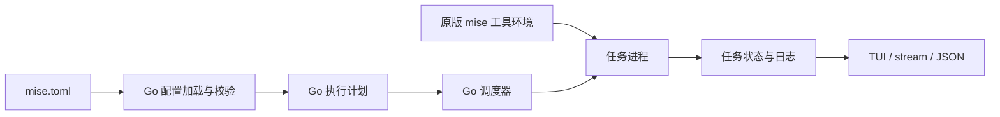

> 已被 [官方 Process Compose 首版接入](2026-09-30-process-compose-integration.md) 替代。下文保留历史设计，不代表当前执行路径。

# ADR 草案：One 使用 Go 解析和执行 mise.toml 任务

状态：Proposed。用户已确认保留原版 mise 的工具安装和版本环境管理，任务解析、调度与执行由 One 接管。本文用于方案评审，尚未实施 Go 任务执行器。

2026-09-30，用户对维护定制 mise 的长期成本提出异议。此前的提交已中止，没有产生新的提交；原有 TUI/复制实现和 mise 扩展源码暂时保留，不能继续作为已批准的发布方案。

## 背景与判断

目标仍是运行中任务列表、完整依赖树、可靠生命周期，以及日志选择与复制。Go 调度器可直接在进程启动和任务完成时产生状态，避免维护 Rust 补丁和额外的多平台 mise 构建。

基础任务执行可控：解析 TOML，生成有向依赖图，检测循环，限量并发，执行命令并汇总结果。完整兼容 mise 的任务行为则是较大的工程，包含配置分层、模板与参数语言、文件任务、交互终端、后置任务、工具环境、缓存和跨平台取消。

One 已有静态任务规划、TOML 库、项目变量加载、进程清理和 TUI 日志存储，可以复用。当前静态 Catalog 专为预览设计，不完整验证所有运行字段，不能直接作为生产执行器使用。

## 建议决策

继续使用 mise.toml。One 自己发现和解析任务配置、编译执行计划、调度依赖、启动和取消任务，并发布状态及日志。原版 mise 只准备所需工具和版本环境。任务执行不再调用 mise run，也不回退到修改过的 mise。

首版以 One、Drama、Composer 当前使用的配置及 One 生成模板为兼容目标。建立明确的支持清单；遇到影响已选任务行为但尚未支持的字段、表达式或覆盖方式，在启动任何任务前给出带路径及任务名的错误。配置文件名相同不能被宣传为全面兼容 mise。

## 职责与约束

| 模块 | 职责 |
| --- | --- |
| 配置加载器 | 确定工作区和配置作用域，读取 TOML、local/profile 层及受支持的本地 include，保留定义来源 |
| 任务编译器 | 规范任务名、别名、参数和等待关系，生成不可变计划，验证循环和不支持的行为 |
| 工具环境适配器 | 调用原版 mise 准备工具版本及 PATH，保持任务级工具声明的作用域 |
| 调度器 | 就绪队列、并发额度、共享执行实例、依赖失败、聚合完成和取消收敛 |
| 进程执行器 | Shell/文件任务、参数透传、工作目录、环境、I/O、跨平台进程清理 |
| 观察与展示 | 进程启动/完整任务结束事件，任务身份明确的日志，运行列表及完整树 |

继续放在 CLI 的任务领域模块，工具环境放在 runtime adapter。Kernel 只提供通用生命周期能力，不引入 mise.toml、任务字段或工作区业务规则。

## 首版必须覆盖

- 字符串和数组 run；多条命令按顺序执行，整个任务只有一个连续生命周期。
- description、dir、alias、raw_args、现有任务名命名空间和需要的通配符。
- depends：把依赖加入计划，依赖完成后才能启动；共享执行实例只执行一次。
- wait_for：只为本次已经安排的执行实例增加等待边，不能据此拉起新任务。Drama 的 server-health 与 Composer 的 validate:dev 已使用此语义。
- 纯聚合节点：没有命令也能参与依赖图，等待时不显示为正在运行的进程。
- 本次调用的项目变量快照，任务环境与工具环境隔离，空值和删除语义保留；日志不包含额外的变量诊断值。
- Shell 及参数透传规则，常驻进程、stdin/交互任务的终端独占策略。
- sources/outputs 新鲜度规则、force，以及现有 One 对变量任务禁用复用的约定。
- Ctrl+C、任务失败、兄弟任务取消和最终退出码；Unix/macOS/Windows 上完成进程树清理。
- 静态计划、执行和 TUI 使用同一任务身份与图。dry-run 不运行命令、不安装工具、不获取远端变量。

配置覆盖、文件任务及本地 includes 必须按实际使用场景补齐测试后启用。不能通过忽略相关字段让不支持的配置“运行成功”。

## 需要显式界定的较复杂能力

depends_post 是完成后的任务阶段，不能像当前展示投影那样简单并入前置依赖。同一任务在前置与后置阶段出现时可能需要执行两次；父任务失败和未启动时的后置行为也不同。若首版未实现，在运行前明确拒绝。

模板、usage 参数语言、复杂依赖对象、远程 includes、任务模板继承、watch、实验性产物缓存、复杂环境插件及完整 mise 配置搜索规则，需逐项决定支持范围。首版不自动追随上游新增字段。

Shell 的 $VAR、管道、重定向等由 Shell 执行；mise 的模板表达式属于配置编译能力，两者不能混为一谈。Windows 参数引用、shebang 和 raw/interactive 的终端行为需要独立验证。

## 失败模式与非功能要求

- 配置不支持、依赖缺失或循环：启动前失败，不执行一半后发现计划不可用。
- 工具准备或变量加载失败：对应任务尚未进入 running，不能显示成业务命令失败。
- 进程成功启动：才发 running；多步骤之间保留整体运行状态；所有步骤结束后发终态。
- 任务失败：阻止不满足条件的下游，按声明的退出策略停止其他任务并回收进程；每个实例最多一个终态。
- 取消与启动同时发生：禁止取消后继续启动新任务，并等待日志及进程清理完成。
- 日志持续产生：复用磁盘历史和有界内存，UI 复制快照不阻塞执行。
- 信任规则和路径边界继续校验，工具/变量信息不写入任务计划或额外诊断日志。
- 已支持的配置行为由 One 自己的测试固定；保留相同配置时，one run 与 mise run 的等价范围须明确记录。

## 迁移顺序

1. 审计真实工作区、模板、CI、hooks 和安装引导，列出字段、Shell 及嵌套 mise run 的使用清单。先确认支持矩阵与参数规则。
2. 实现严格加载与编译，并以现有工作区做静态差异比较；发现不支持配置时补齐实现或给出明确迁移方案。
3. 以临时工作区验证 Go 调度器的依赖/等待、并发、常驻任务、多步骤、失败及取消；先确保执行语义，再接入 TUI。
4. 将项目变量快照直接交给任务进程，移除为 mise 调度器提供变量的临时绑定桥接。验证项目隔离、并发调用、别名与子进程。
5. 让已实现的树、运行列表和复制功能消费 Go 事件；stream/raw/结构化输出共用该调度器。
6. 移除 Rust 补丁、内嵌 mise 事件运行时、构建工具和新增运行时 CI；同步文档、协议说明及测试。
7. 审计并迁移 CI、hooks、模板和任务中的嵌套 mise run，避免仍有任务图交给原调度器。安装引导使用原版 mise 准备工具后编译 One，再交给 One 执行任务。
8. 跑 One 的相关质量门，并以 Drama/Composer 开发依赖图验收，特别核对健康检查放行和取消后的清理。

## 取舍与备选方案

| 方案 | 收益 | 成本与限制 |
| --- | --- | --- |
| Go 执行器，覆盖明确子集（建议） | 任务状态由 One 掌握；Go 工具链统一；UI 和项目环境更易整合 | One 承担调度和兼容责任，需要支持矩阵与跨平台回归 |
| 原版 mise 继续调度 | 保留最广的任务行为兼容 | 当前实时状态接口不满足需求，运行列表的目标受限 |
| 定制 mise 补丁 | 延用已有调度器并取得事件 | Rust、多平台运行时及上游补丁维护成本；用户已提出异议 |
| 完整复刻 mise 任务生态 | 同一配置的兼容面最广 | 范围大且持续变化，不宜作为此次 TUI 功能的首版承诺 |

## 验收与当前状态

核心验收：无需服务配置；安静任务也能进入运行列表；结束后树与日志上下文保持；多步骤/等待边/项目变量/参数/退出码正确；三类操作系统的进程清理与真实终端交互通过。

本文是架构提案。工具管理边界已由用户确认，完整支持清单与实施计划仍待评审；本轮未新增 Go 执行逻辑、未删除旧实现，也未继续提交。

## 参考

- [mise 任务配置](https://mise.jdx.dev/tasks/task-configuration.html)：依赖、等待、后置阶段、工具及配置覆盖。
- [mise 任务执行](https://mise.jdx.dev/tasks/running-tasks.html)：并发、参数和终端交互。
- [mise 文件任务](https://mise.jdx.dev/tasks/file-tasks.html)：文件发现与跨平台解释器。
- [mise 配置](https://mise.jdx.dev/configuration.html)：配置层级及工具/环境/任务的职责。
- 本地 mise 2026.9.7 源码：Task、task_executor、Deps 和 run 调度流程；One 的 tasks、runtime adapter 及 process 实现。
