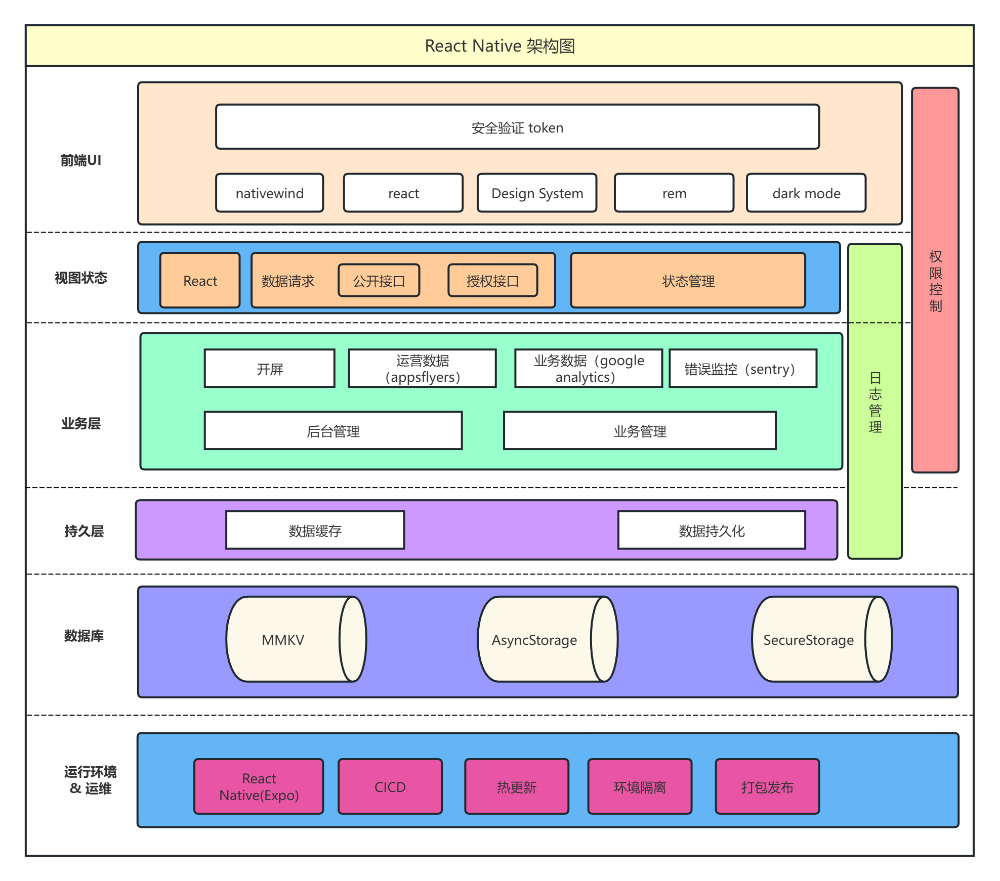

# Mobile RN Expo Template

基于 Expo Router 的 React Native 模板，适合快速起一个带路由、状态管理、SWR 请求缓存和 NativeWind 样式体系的移动端项目。

> **TODO**：当前固定在 Expo SDK 52 + React 18，待协调升级到 SDK 53 + React 19（需同步升 RN 0.79、Expo Router v5 及全部 `expo-*` 包；升级后需 `expo doctor` + 真机验证）。

## 项目架构



## 技术栈

- Expo 52
- Expo Router
- React Native 0.76
- React 18
- NativeWind
- SWR
- Zustand
- Axios
- ahooks
- React Native Reanimated
- React Native Gesture Handler
- react-native-mmkv
- oxlint + oxfmt

## 目录结构

```text
scripts/
└── reset-project.js      # 重置示例页面
src/
├── api/                  # 请求 key 与纯函数 API
├── app/                  # Expo Router 页面
│   └── (tabs)/           # Tab 页面
├── assets/               # 图片与字体资源
├── components/           # 通用组件与 UI 片段
├── constants/            # API / 颜色常量
├── hooks/                # 业务 hooks 与 SWR 初始化
├── lib/                  # axios、mmkv、helper、auth
├── store/                # Zustand stores
└── types/                # 类型定义
```

## 快速开始

```bash
pnpm install
pnpm start
```

其他常用入口：

- `pnpm android`
- `pnpm ios`
- `pnpm web`

## 常用命令

| 命令 | 说明 |
| --- | --- |
| `pnpm start` | 启动 Expo 开发服务 |
| `pnpm reset-project` | 重置模板示例页面 |
| `pnpm android` | 运行 Android |
| `pnpm ios` | 运行 iOS |
| `pnpm web` | 启动 Web 预览 |
| `pnpm test` | 运行 Jest |
| `pnpm lint` | 执行 oxlint |
| `pnpm lint:fix` | 自动修复 lint 问题 |
| `pnpm format` | 检查格式 |
| `pnpm format:fix` | 自动格式化 |
| `pnpm check` | 执行 lint + format |
| `pnpm check:fix` | 执行 lint:fix + format:fix |

## 请求层约定

RN 模板已经按 “`key + pure function`” 的形式组织请求模块：

```ts
export const commonPublicApiKey = "/common/public";

export const commonPublicApi = async () => {
  const resp = await axiosPublic.post(commonPublicApiKey);
  return resp.data.data;
};
```

页面或 hooks 中直接复用导出的 key 和请求函数：

```tsx
const { data, isLoading } = useSWR(commonPublicApiKey, commonPublicApi);
```

带参数的请求则使用闭包包装：

```tsx
const { data } = useSWR(
  user ? [commonAuthApiKey, user] : null,
  () => commonAuthApi({ user }),
);
```

当前示例可参考：

- `src/api/common.ts`
- `src/api/auth.ts`
- `src/api/token.ts`

## 状态与基础设施

- `src/hooks/setup/swr.ts` 负责 SWR 全局配置
- `src/lib/mmkv.ts` 提供本地持久化能力
- `src/store/config.ts`、`src/store/session.ts`、`src/store/secure.ts` 分别承载普通状态、会话状态和敏感状态
- `global.css` 与 `tailwind.config.js` 负责 NativeWind 样式基线

## 说明

这是模板仓库，不包含工作区级 CI、Docker、K8s 或 secrets 逻辑。这些内容由 `one-cli` 在根工作区统一生成和治理。
