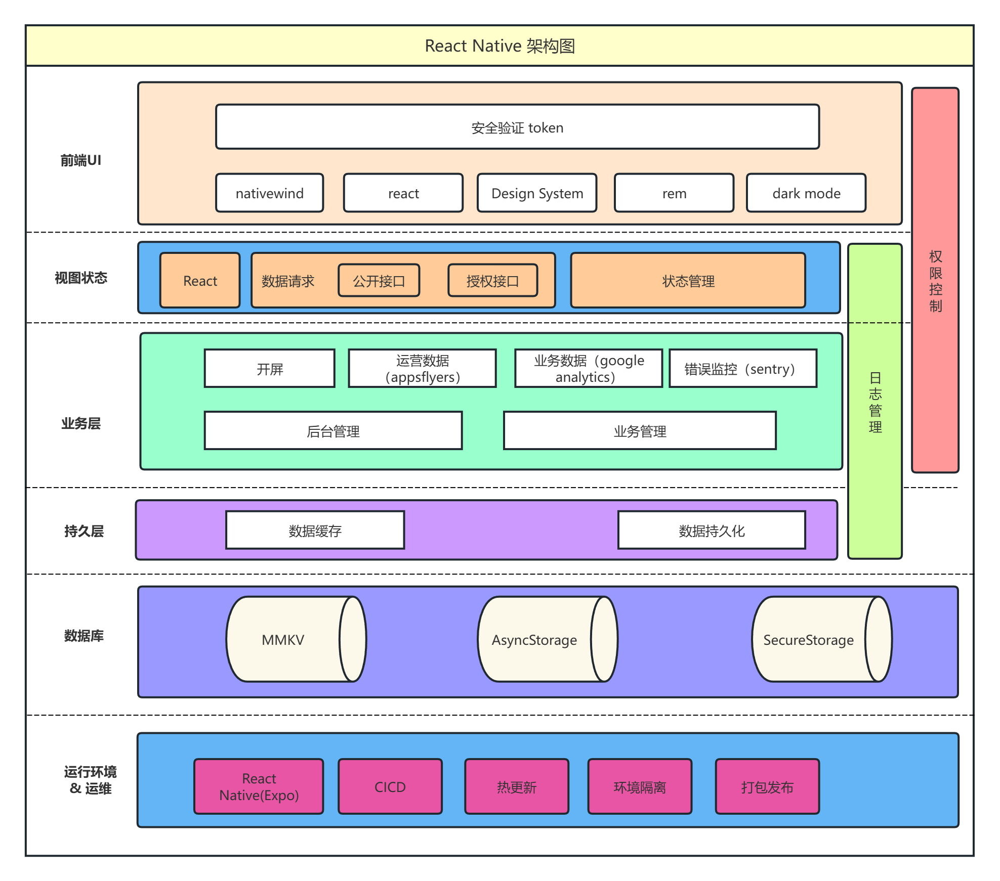

# Mobile RN Expo Template

基于 Expo Router 的 React Native 模板，适合快速起一个带路由、状态管理、SWR 请求缓存和 NativeWind 样式体系的移动端项目。

依赖以 Expo SDK 57 的兼容版本表为准；React、React Native、Reanimated 和 Worklets 需要随 SDK 一起升级。

## 项目架构



## 技术栈

- Expo 57
- Expo Router 57
- React Native 0.86
- React 19.2
- TypeScript 7
- NativeWind 4 + Tailwind CSS 3.4
- SWR
- Zustand
- Axios
- ahooks
- React Native Reanimated 4 + Worklets
- React Native Gesture Handler
- react-native-mmkv 4 + Nitro Modules
- oxlint + oxfmt

## 目录结构

```text
scripts/
└── reset-project.js      # 重置示例页面
src/
├── api/                  # 请求 key 与纯函数 API
├── app/                  # Expo Router 页面
│   └── (tabs)/           # Tab 页面
├── assets/               # 图片与字体资源
├── components/           # 通用组件与 UI 片段
├── constants/            # API / 颜色常量
├── hooks/                # 业务 hooks 与 SWR 初始化
├── lib/                  # axios、mmkv、helper、auth
├── store/                # Zustand stores
└── types/                # 类型定义
```

## 快速开始

使用 Node.js 24 LTS（24.15 或更新版本）和 pnpm 12.3.4。MMKV 使用原生模块，移动端请通过 development build 运行。

```bash
pnpm install
pnpm start
```

其他常用入口：

- `pnpm android`
- `pnpm ios`
- `pnpm web`

## 依赖升级约定

- `expo-*`、React 和 React Native 相关原生依赖采用 SDK 57 推荐的兼容组合，不单独追随各包的最新主版本。
- 导航组件和主题从 `expo-router/js-tabs`、`expo-router/react-navigation` 导入，使用 Router 内置的导航实现。
- NativeWind 4 的样式运行时依赖 Tailwind CSS 3，当前使用该系列最新的 3.4.19；NativeWind 5 仍处于预览阶段。
- Expo 的 Babel preset 和 Jest preset 使用 Babel 7、Jest 29，保留这两个兼容系列的最新版本。
- `react-test-renderer` 与 React 固定为相同版本。
- 模板使用 TypeScript 7.0.2。SDK 57 官方默认版本仍为 TypeScript 6，因此通过 `expo.install.exclude` 明确保留此版本差异，避免 `expo install --fix` 改回默认版本。
- `tsconfig.json` 显式加载 Node 和 Jest 全局类型，`src/types/styles.d.ts` 声明 CSS 导入，适配 TypeScript 7 的类型发现与副作用导入检查。
- 升级后运行 `pnpm exec expo install --check`、`pnpm dlx expo-doctor`、`pnpm exec tsc --noEmit`、`pnpm exec expo export --platform web`，并在 Android/iOS development build 上验证原生功能。

参考 [Expo 升级指南](https://docs.expo.dev/workflow/upgrading-expo-sdk-walkthrough/) 和 [NativeWind 安装说明](https://www.nativewind.dev/docs/getting-started/installation)。

## 常用命令

| 命令                 | 说明                       |
| -------------------- | -------------------------- |
| `pnpm start`         | 启动 Expo 开发服务         |
| `pnpm reset-project` | 重置模板示例页面           |
| `pnpm android`       | 运行 Android               |
| `pnpm ios`           | 运行 iOS                   |
| `pnpm web`           | 启动 Web 预览              |
| `pnpm test`          | 运行 Jest                  |
| `pnpm lint`          | 执行 oxlint                |
| `pnpm lint:fix`      | 自动修复 lint 问题         |
| `pnpm format`        | 检查格式                   |
| `pnpm format:fix`    | 自动格式化                 |
| `pnpm check`         | 执行 lint + format         |
| `pnpm check:fix`     | 执行 lint:fix + format:fix |

## 请求层约定

RN 模板已经按 “`key + pure function`” 的形式组织请求模块：

```ts
export const commonPublicApiKey = "/common/public";

export const commonPublicApi = async () => {
  const resp = await axiosPublic.post(commonPublicApiKey);
  return resp.data.data;
};
```

页面或 hooks 中直接复用导出的 key 和请求函数：

```tsx
const { data, isLoading } = useSWR(commonPublicApiKey, commonPublicApi);
```

带参数的请求则使用闭包包装：

```tsx
const { data } = useSWR(user ? [commonAuthApiKey, user] : null, () => commonAuthApi({ user }));
```

当前示例可参考：

- `src/api/common.ts`
- `src/api/auth.ts`
- `src/api/token.ts`

## 状态与基础设施

- `src/hooks/setup/swr.ts` 负责 SWR 全局配置
- `src/lib/mmkv.ts` 提供本地持久化能力
- `src/store/config.ts`、`src/store/session.ts`、`src/store/secure.ts` 分别承载普通状态、会话状态和敏感状态
- `global.css` 与 `tailwind.config.js` 负责 NativeWind 样式基线

## 说明

这是模板仓库，不包含工作区级 CI、Docker、K8s 或 secrets 逻辑。这些内容由 `one-cli` 在根工作区统一生成和治理。
